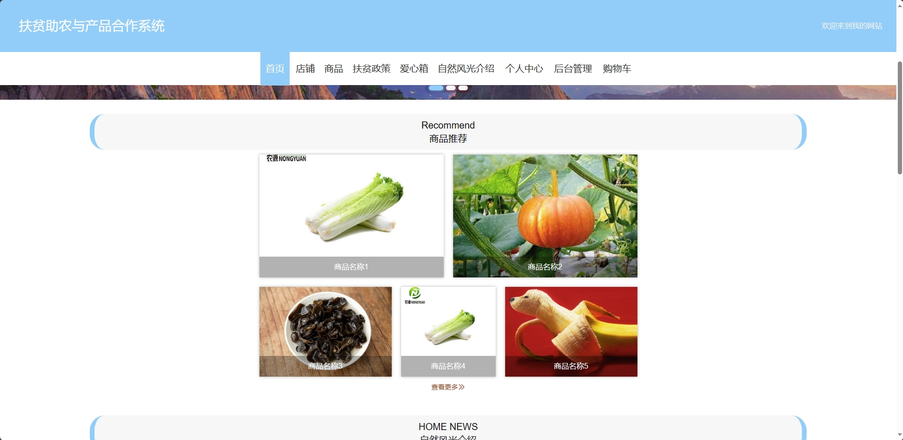
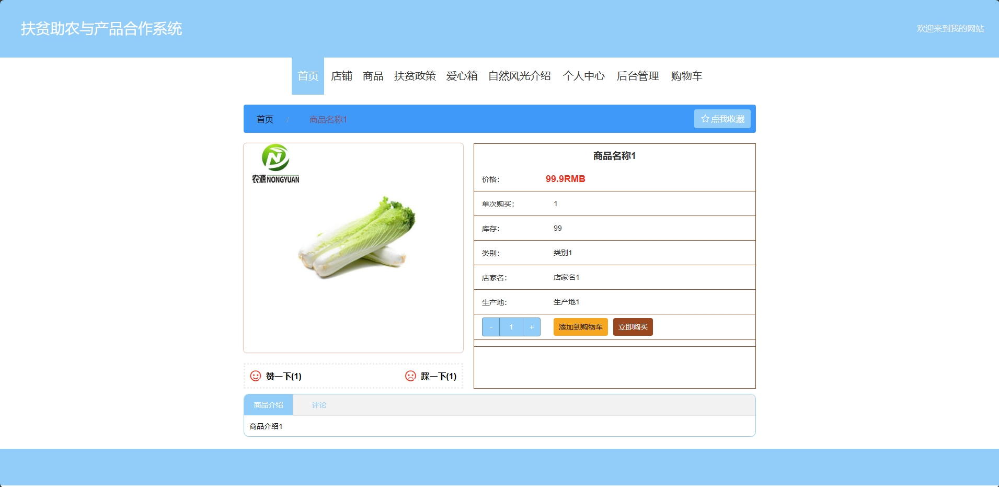
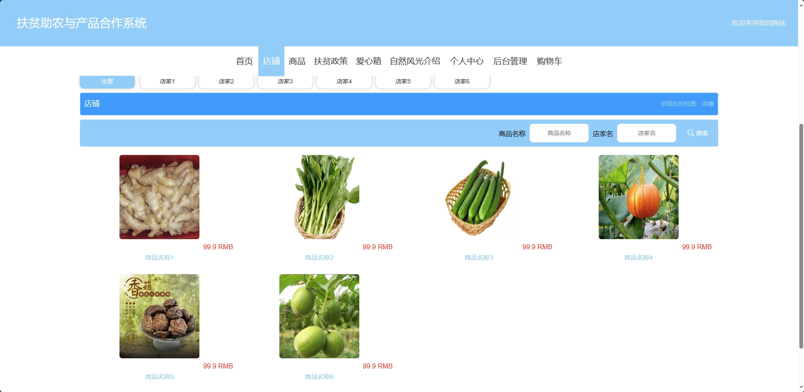
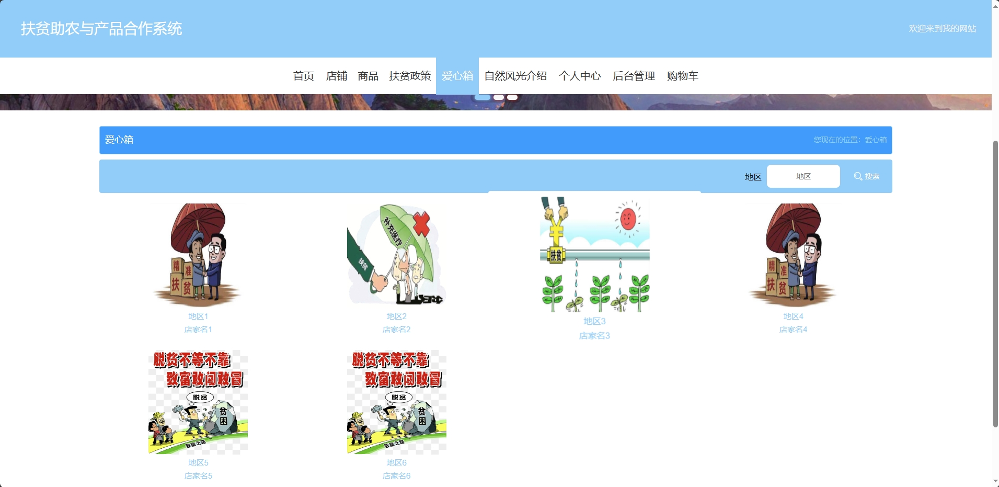
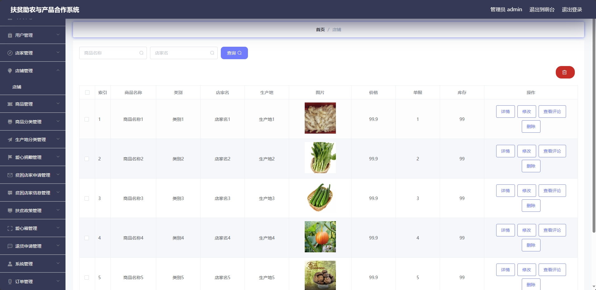
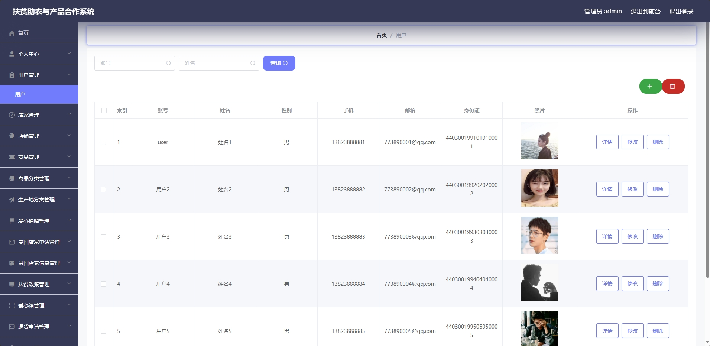

<h1 align="center">基于SSM的扶贫助农管理系统</h1>

 获取sql文件 QQ: 605739993 QQ群: 377586148 

<b> 需要视频演示可联系上述QQ，私发视频链接 </b>

 [更多源码项目: 从戎源码网](https://armycodes.com/)

## 简介

> 本代码来源于网络,仅供学习参考使用!
>
> 提供1.远程部署/2.修改代码/3.设计文档指导/4.框架代码讲解等服务
> 
> 管理后台访问地址： http://localhost:8081/
>
> 管理员 : admin 123456
> 
> 店家：店家1 123456
>
> 用户端访问地址：http://localhost:8080/springboot333w4/front/index.html
> 
> 用户：user 123456
>

## 项目介绍
基于SSM的扶贫助农管理系统：前端 Vue、ElementUI，后端 Maven、SpringBoot、MyBatis；角色分为管理员、用户和店家，管理员在管理后台对公告进行发布，对商户进行管理，平台扶贫政策的设立等；店铺对商品进行发布，根据平台发布的扶贫政策申请贫困商户等； 用户可以根据商品进行购买，对贫困商户进行爱心捐赠，自然风光的了解，购买商品等。主要功能如下：

### 管理员：

- 基本操作：登录、修改密码、修改个人信息、上传图片、获取个人信息、附件下载
- 退货申请管理：获取退货申请信息列表、筛选退货申请信息、删除退货申请信息、修改退货申请信息、退货
- 扶贫政策管理：获取扶贫政策列表、筛选扶贫政策信息、删除扶贫政策信息、修改扶贫政策信息、查看扶贫政策信息详情、查看评论、回复评论、发布扶贫政策信息、下载政策文件
- 贫困店家信息管理：获取贫困店家信息列表、筛选贫困店家信息、删除贫困店家信息、修改贫困店家信息、下载申请资料、创建爱心信箱
- 爱心箱管理：获取爱心箱信息列表、筛选爱心箱信息、删除爱心箱信息、修改爱心箱信息、查看评论、回复评论
- 贫困店家申请管理：获取贫困店家申请列表、筛选贫困店家申请信息、删除贫困店家申请信息、修改贫困店家申请信息、审核贫困店家申请、下载申请资料、信息登记
- 爱心捐赠管理：获取爱心捐赠列表、筛选爱心捐赠信息、删除爱心捐赠信息、删除爱心捐赠信息、修改爱心捐赠信息、查看爱心捐赠信息详情
- 生产地分类管理：获取生产地分类列表、筛选生产地分类信息、删除生产地分类信息、修改生产地分类信息
- 商品管理：获取商品列表、筛选商品信息、删除商品信息、修改商品信息、查看商品信息详情、查看评论、回复评论
- 商品分类管理：获取商品分类列表、筛选商品分类信息、删除商品分类信息、修改商品分类信息
- 店铺管理：获取店铺列表、筛选店铺信息、删除店铺信息、修改店铺信息、查看店铺信息详情、查看评论、回复评论
- 轮播图管理：获取轮播图列表、筛选轮播图信息、删除轮播图信息、修改轮播图信息、查看轮播图信息详情
- 自然风光管理：获取自然风光列表、筛选自然风光信息、删除自然风光信息、修改自然风光信息、查看自然风光信息详情、发布自然风光信息
- 订单管理：获取订单列表、筛选订单信息
- 店家管理：获取店家列表、筛选店家信息、修改店家信息、删除店家信息、添加店家信息、查看店家信息详情
- 用户管理：获取用户列表、筛选用户信息、修改用户信息、删除用户信息、添加用户信息、查看用户信息详情

### 店家：

- 基本操作：登录、修改密码、修改个人信息、上传图片、获取个人信息、注册
- 店铺管理：获取店铺列表、筛选店铺信息、查看店铺详情、删除店铺信息
- 商品管理：获取商品列表、筛选商品信息、查看商品详情、发布商品、查看商品详情
- 商品分类管理：获取商品分类列表、筛选商品分类信息、新增商品分类
- 生产地分类管理：获取生产地分类列表、筛选生产地分类信息、新增生产地分类
- 贫困店家申请管理：获取贫困店家申请列表、筛选贫困店家申请信息、贫困店家申请、审核回复、删除贫困店家申请信息
- 订单管理：获取订单列表、筛选订单信息、发货、退款、查看订单信息详情

### 用户：

- 基本操作：登录、修改密码、修改个人信息、上传图片、获取个人信息、注册、获取轮播图列表、账户充值、收货地设置
- 商品模块：获取商品列表、筛选商品信息、查看商品详情、赞一下、踩一下、评论商品、添加购物车、支付、获取店家分类、获取生产地分类、收藏
- 扶贫政策模块：获取扶贫政策列表、筛选扶贫政策信息、查看扶贫政策详情、政策文件下载、评论扶贫政策
- 爱心箱模块：获取爱心箱列表、筛选爱心箱信息、查看爱心箱详情、赞一下、踩一下、评论商品、添加购物车、支付
- 自然风光模块：获取自然风光列表、筛选自然风光信息、查看自然风光详情
- 订单模块：获取订单列表、查看订单详情、筛选订单信息、支付、退款、确认收货

## 环境

- <b>IntelliJ IDEA 2020.3</b>

- <b>Mysql 5.7.26</b>

- <b>NodeJs 14.17.3</b>

- <b>Maven 3.6.3</b>

- <b>JDK 1.8</b>

## 运行截图

